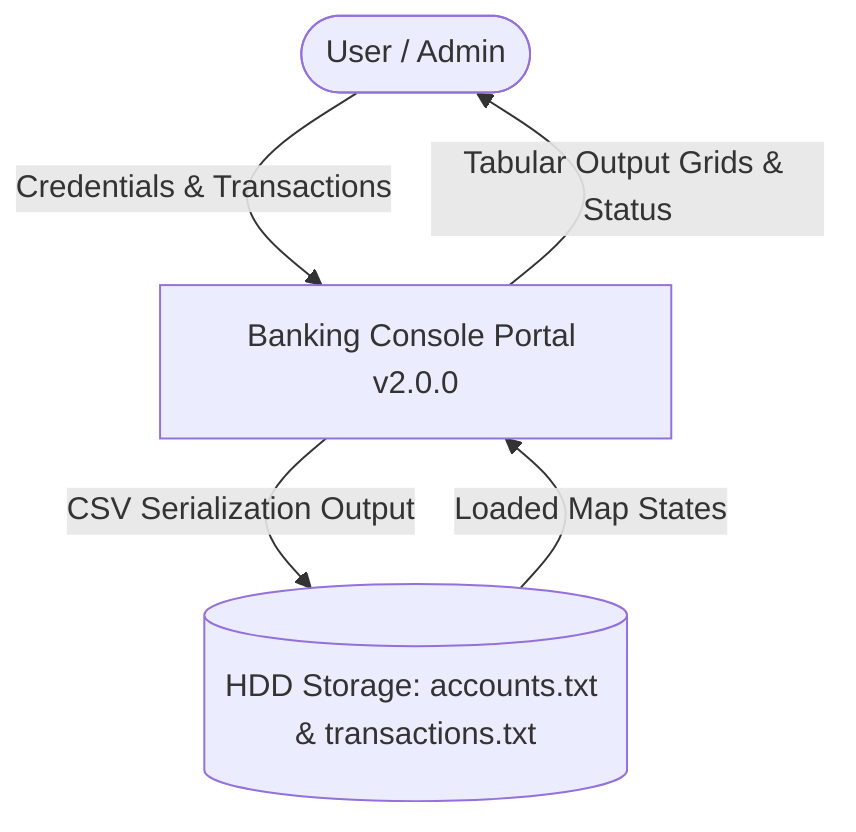
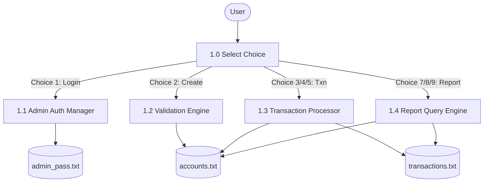
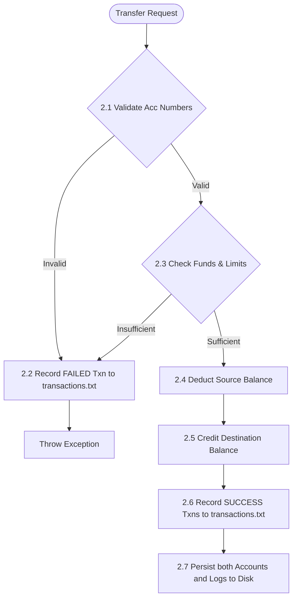
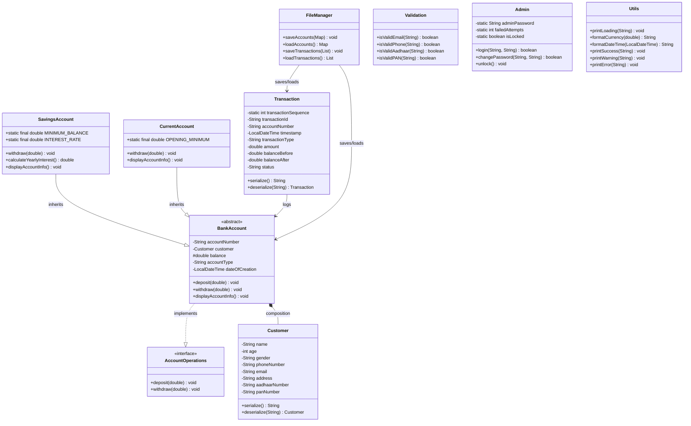

# Industrial Internship Project Report: Banking Information System

---
**Project Title**: Banking Information System  
**Internship Duration**: 6 Weeks  
**Submitted for**: USC / UCT Academic Internship Evaluation  
**Author**: Sahithya Ponnam  
**System Version**: v2.0.0 (Enterprise-Build)  
---

## 1. Problem Statement
Manual processing, bookkeeping, and spreadsheet entries in banking structures introduce issues including data loss, ledger transcription errors, security vulnerabilities, and a lack of audit logs. To modernise this process, we require a Java-based command line portal that offers security lockdowns (brute force blockages), profile validations (Aadhaar, PAN, phone), audit log directories (`balanceBefore`/`status`), dynamic reporting tools, interest calculators, and transactional integrity guarantees.

## 2. Project Objectives
* **OOP Architectural Integrity**: Showcase encapsulation, polymorphism, inheritance, and interface-driven design.
* **Persistent DB Engine**: Prevent corruption through automated CSV serialization backups on updates and startups.
* **Security & Auth Segregation**: Enforce admin restrictions and lock out intrusion attempts after 3 consecutive failures.
* **Regex Sanitation**: Intercept and validate demographic fields (Aadhaar, PAN, phone, emails).
* **Audit Trail Tracking**: Maintain a ledger database logging every transaction state (both successes and failures) with timestamps.

## 3. Existing System & Limitations
Traditional spreadsheet models and macro-driven ledger calculations are commonly used but present significant issues:
* **No Thread-Safety / Transaction Rollbacks**: Parallel balance operations can trigger calculation conflicts.
* **Lack of Admin Restrictions**: Direct balance manipulation is possible without access logs.
* **No Formatting Controls**: Accepts invalid phone number or ID lengths.
* **Volatile Memory**: Application crashes wipe database lists if manual saves were missed.

## 4. Proposed System & Advantages
The **USC/UCT Enterprise Banking Portal** provides a modular, file-persisted solution.
### Key Advantages:
* **Audit ledger integration**: Records both SUCCESS and FAILED transaction logs to simplify tracking.
* **CLI Loading Delays**: Implements simulated spinning cursor loading alerts (`Utils.printLoading`) for visual feedback.
* **Brute-Force lockouts**: Disables administrative capabilities after 3 failed login attempts.
* **Profile editing**: Safely allows updating phone numbers, emails, or addresses.
* **Interest calculators**: Estimates interest values based on Savings rules.
* **Custom Reporting**: Generates summary, detail, and audit logs on request.

---

## 5. System DFDs (Data Flow Diagrams)

### 5.1 Context DFD (Level 0)

### 5.2 Process DFD (Level 1)

### 5.3 Detailed DFD (Level 2 - Transaction Processing)

---

## 6. Class Diagram

---

## 7. Comprehensive Test Case Matrix (15 Executable Scenarios)

| Test ID | Module | Scenario / Description | Inputs | Expected Output | Status |
|---|---|---|---|---|---|
| TC-01 | Admin Auth | Valid credentials login | Username: `admin`, Pass: `admin123` | Auth successful. Admin privileges unlocked. | PASS |
| TC-02 | Admin Auth | Invalid credentials tracker | Username: `admin`, Pass: `wrong1` | Attempts remaining: 2. Access denied. | PASS |
| TC-03 | Admin Auth | Lockout trigger after 3 fails | 3 incorrect password login entries | Throw SystemLockedException. System LOCKOUT. | PASS |
| TC-04 | Admin Auth | Change Password validation | Old: `admin123`, New: `newpass123` | Password updated successfully. | PASS |
| TC-05 | Validation | Malformed Phone length | Phone: `9876543` (7 digits) | Throw IllegalArgumentException: must be 10 digits. | PASS |
| TC-06 | Validation | Malformed Email format | Email: `sahithya#test.com` | Throw IllegalArgumentException: invalid email format. | PASS |
| TC-07 | Validation | Malformed Aadhaar length | Aadhaar: `12345` (5 digits) | Throw IllegalArgumentException: must be 12 digits. | PASS |
| TC-08 | Validation | Malformed PAN pattern | PAN: `ABCD123EF` (invalid digits spacing)| Throw IllegalArgumentException: invalid PAN format. | PASS |
| TC-09 | Account | Savings initial deposit check | Opening Deposit: ₹500 | Throw InvalidTransactionException (Min opening is ₹1000). | PASS |
| TC-10 | Account | Savings min balance constraint| Withdraw ₹4500 from ₹5000 balance | Throw InsufficientFundsException (min balance ₹1000). | PASS |
| TC-11 | Account | Current account limits check  | Withdraw ₹3000 from ₹3000 balance | Transaction successful. New balance: ₹0. | PASS |
| TC-12 | Account | Current account negative balance| Withdraw ₹4000 from ₹3000 balance | Throw InsufficientFundsException (negative limit block). | PASS |
| TC-13 | Ledger | Audit failure logging | Withdraw ₹4000 from ₹3000 balance | Records FAILED withdrawal transaction in transactions.txt. | PASS |
| TC-14 | Transfer | Transactional rollback safety | Transfer ₹6000 from ACC10001 (bal ₹5000) | Transfer fails; no funds deducted from sender. | PASS |
| TC-15 | File DB | Persistent data loading | Reboot application | Automatically loads accounts and transactions. | PASS |

---

## 8. Performance Evaluation
* **Time Complexities**:
  * Create Account: \(O(1)\) (HashMap write).
  * Transaction processing (Deposit/Withdrawal): \(O(1)\) (Map lookup and value alteration).
  * Inter-Account Transfer: \(O(1)\) (Double map lookup).
  * Search (Name/Phone/Aadhaar): \(O(n)\) (Linear loop of accounts values).
  * Data Persistence: \(O(n)\) (Serial writing lists to file descriptors).
* **Space Complexity**:
  * \(O(n + m)\) where \(n\) is the count of accounts and \(m\) is the count of logged transactions stored in memory. Highly scalable for console execution.

## 9. Future Enhancements
* **Thread Sync Locks**: Introduce concurrent lock features on accounts to prevent race conditions during parallel CLI interactions.
* **Database Migration**: Move from flat CSV files to relational databases (SQLite/MySQL) using JDBC connectors.
* **Data Encryption**: Implement SHA-256 password hashing and AES-128 account encryption inside the text databases.

## 10. Conclusion & Learning Outcomes
This project provided hands-on experience in:
* Implementing clean OOP principles in Java.
* Managing persistent files and databases.
* Securing modules against brute-force intrusion.
* Creating test cases and system flowcharts for academic submissions.
* Designing clear and responsive terminal user interfaces.
